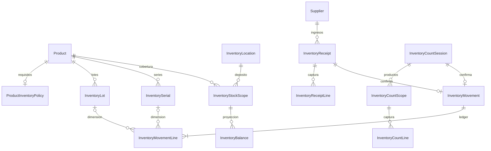

# Inventory V1 implementado

Actualización del 8 de octubre de 2026: [Remitos + OUTBOUND](delivery-notes.md) extiende el posting y el ledger existentes con fuente tipada DeliveryNote y allocations físicas. Las referencias a salidas/Remitos diferidos en el reporte V1 siguiente describen su alcance histórico del 6 de octubre; ese punto está implementado por el nuevo incremento.

Fecha de entrega: 6 de octubre de 2026. Este documento describe el código real del incremento operativo reducido. [inventory-design.md](inventory-design.md) conserva el diseño original y sus alternativas; no es una lista de funcionalidades disponibles.

Inventory permite ingresar mercadería de un proveedor, contar existencias iniciales gradualmente, consultar stock/historia y registrar diferencias administrativas sobre posiciones existentes. Catalog sigue identificando artículos; importar una lista, crear/identificar un Product, reconocer un código o guardar un borrador genera **cero stock**.

## 1. Modelo finalmente implementado



Las relaciones del diagrama son conceptuales; el schema usa claves compuestas explícitas, no una FK directa Balance → StockScope. Las 13 entidades nuevas tienen organizationId. Se reutilizan Product, Supplier, Membership, Session, AuditService, los guards y los contratos de identificación. No existe Product.stock ni una tabla genérica de stock editable.

ProductInventoryPolicy exige revisión ADMIN de tres flags, inicialmente false: lotRequired, expirationRequired y serialRequired. La ausencia de política no equivale a una política aprobada. InventoryLocation crea de forma diferida un único `MAIN` / “Depósito principal” por tenant, al abrir la primera operación; las consultas no crean filas. InventoryStockScope es el ancla Product + Location para versión, cobertura inicial y toma exclusiva de conteo, incluso si todavía no hay saldo.

## 2. Qué entró del diseño original

Ledger con encabezado/líneas, balance reconstruible, lotes, series opcionales por política, vencimiento físico, condiciones, ubicación plana, ingresos persistidos, conteo inicial persistido, captura HID existente, cantidades exactas, disponibilidad, auditoría, tenant constraints, locks e idempotencia. Se agregó un ajuste ADMIN deliberadamente acotado.

## 3. Qué se difirió

OUTBOUND/Remitos, devoluciones, reservas, transferencias entre condiciones/ubicaciones, FEFO operativo, packaging/conversiones/calculadora, recuento con movimientos concurrentes, LotRevision, corrección de identidad física, reversión completa de documentos, alertas/minStock, notificaciones, múltiples depósitos administrables, parser GS1 completo e integración regulatoria. No hay tablas ficticias de Remito ni campos ANMAT inventados.

## 4. Migraciones

Se conservan las cinco migraciones anteriores. Se agregaron:

- `20261006220000_inventory`: entidades, enums, índices, FK compuestas, checks y triggers de protección.
- `20261006223000_inventory_hardening`: refuerza coherencia nullable de lote, cantidad/series de captura y motivos de ajuste. Se creó separada porque la anterior ya se había aplicado durante la verificación; no se reescribió su checksum.

Instalaciones existentes: `pnpm db:migrate`. No usar db push. No hay backfill de existencias ni políticas inventadas para los Products anteriores. La migración local no ingresa mercadería. La suite de Inventory crea una base vacía propia y aplica las siete migraciones desde cero.

## 5. Constraints e invariantes

- Unicidad tenant de ubicación, política, scope, lote nombrado, serie y claves de confirmación.
- FK compuestas defienden tenant y, donde corresponde, Product, Location, Supplier, Membership y Session; una línea de fuente no puede pertenecer a otro documento/producto/depósito.
- Balance único por org/Product/Location/lot?/serial?/condition con **NULLS NOT DISTINCT**. No depende del comportamiento normal de UNIQUE con NULL.
- quantity >= 0; balances serializados 0/1; índice parcial impide dos posiciones positivas de una misma serie. UNIT/PAIR enteros; deltas de serie ±1; ningún delta cero.
- Forma tipada de fuente y tipo: RECEIPT → Receipt, INITIAL_COUNT → CountSession, ADJUSTMENT → operación directa con motivo/explicación. El ledger no usa sourceId arbitrario.
- Movimiento sellado y líneas inmutables; trigger diferido exige movimiento completo, no vacío y sellado al commit. El sellado interno ocurre dentro de la misma transacción, nunca es un estado operativo visible para editar.
- Cabeceras/líneas/scopes confirmados o cancelados no admiten mutación. Triggers de captura bloquean el padre para evitar inserciones tardías.
- Product no puede cambiar unidad con historia o conteo inicial confirmado, ni archivarse con existencia/conteo activo. La aplicación da mensajes humanos; PostgreSQL refuerza estas restricciones.
- Política y datos de identidad física históricos no se editan ni borran silenciosamente.

La coherencia ledger/balance la mantiene el único caso de uso transaccional de posting y la comprueba el verificador. No hay trigger que convierta cualquier SQL sobre balance en un movimiento. El owner de DB conserva capacidades privilegiadas; no se afirma RLS ni protección absoluta contra un administrador de PostgreSQL.

## 6. Cantidades y precisión

PostgreSQL NUMERIC(20,6); JSON transporta strings decimales canónicos. El dominio opera con BigInt escalado por 1.000.000, sin Number/parseFloat para cantidades. UNIT y PAIR aceptan enteros; METER/CENTIMETER/LITER/MILLILITER/KILOGRAM/GRAM aceptan hasta seis decimales. El saldo de una posición admite hasta 99.999.999.999.999,999999; la captura limita a menos de 1.000.000.001 por línea y la base protege desbordamiento del saldo. Texto inválido, notación exponencial, negativos o precisión extra se rechazan.

La unidad base es Product.unitOfMeasure. presentation es descriptiva: una caja x100 de un Product UNIT se ingresa como 100; si el artículo indivisible se maneja por caja, Catalog debe representar correctamente esa unidad antes de su primera historia. No se deducen conversiones desde strings ni se convierte PAIR en dos UNIT. Un rollo METER puede ingresarse como 3.125; consumo parcial queda para salida futura. Se congela la unidad después de historia, aun cuando el saldo vuelva a cero.

## 7. Lotes

Identidad de lote nombrado: organizationId + productId + normalizedLotNumber. V1 normaliza recortando espacios de extremos; conserva case, ceros y puntuación. Proveedor y vencimiento **no** forman parte de la clave. Recepciones distintas/proveedores distintos del mismo Product/lote reutilizan la misma fila. Mismo número en Products diferentes no colisiona.

expirationDate nullable pertenece al lote; un vencimiento contradictorio rechaza toda confirmación, incluyendo cambiar null por fecha. No se sobrescribe. lotId permite reutilización explícita tenant/Product-scoped. Sin lote ni vencimiento se usa posición sin lote; vencimiento sin número crea una identidad física anónima propia de esa captura, sin afirmar que coincide con otras recepciones. No se intenta reconstruir identidad real con la fecha.

## 8. Series

InventorySerial existe únicamente para políticas serialRequired; se identifica por tenant/Product/número recortado, case-sensitive. La cantidad se deriva de las series, una por línea de texto, y debe coincidir con su número. Cada línea del ledger de serie representa exactamente una unidad; no se obliga a serializar todo el catálogo. Política serial solo admite UNIT/PAIR. La asociación lote/serie se registra en líneas/posiciones, no en un campo mutable de Serial.

Se rechazan repeticiones en una captura/documento y una serie ya presente. Un reingreso posterior no puede alterar silenciosamente el último lote conocido de esa serie. No se habilitan series anónimas ni excepciones a los requisitos físicos; una falta de datos se resuelve antes de confirmar. Límite: 100 series por línea y 500 por documento.

## 9. Vencimiento

DATE de calendario nullable, no timestamp. Fecha de negocio en America/Argentina/Buenos_Aires. El día de vencimiento es inclusivo: vencido si expirationDate < businessDate. “Próximo a vencer” contempla 30 días inclusive y solo fechas no vencidas. Lotes vencidos pueden registrarse y siguen físicamente presentes. Vencer no crea un movimiento ni modifica el balance; las lecturas evalúan la fecha actual. No hay eliminación automática.

## 10. Condiciones y disponibilidad

USABLE, DAMAGED, QUARANTINE son dimensiones de posición. physical suma existencias; unavailable suma la unión de condición no utilizable **o** vencimiento, sin contar dos veces un dañado vencido. available = physical - unavailable; reserved no existe en V1. Una existencia dañada puede ingresarse/contarse así desde el comienzo. Convertir una posición usable en dañada requiere el futuro movimiento pareado de reclasificación: no se simula con una baja física. DAMAGE_DISPOSAL en ajuste sí representa retirar/desechar físicamente cantidad.

La UI muestra cobertura inicial separada de los saldos. Un producto no inicializado muestra solamente existencia registrada; no se promete que esos ingresos representan todo lo que ya había en el depósito. Sin salidas comerciales integradas, la precisión continua exige registrar las variaciones mediante los casos de uso disponibles.

## 11. Ingreso

Proveedor obligatorio → abrir borrador → scan conocido → requisitos/qty/lote/fecha/series/condición → Agregar → siguiente scan → revisar → confirmar. Hasta 50 líneas persistidas. Captura/agregado/corrección/quitar no crean movimientos. Confirmar revalida Product activo, unidad, política, proveedor, lotes/series, exclusión de conteo, versiones y permisos, y registra todo de forma atómica. Solo el autor edita/confirma el borrador; ADMIN puede consultar/cancelar borradores ajenos. Confirmados son consultables por el tenant.

## 12. Inventario inicial

Sesiones pequeñas persistidas, hasta diez Products, retomables sin stock provisional. La toma de Product + Location bloquea otros conteos y nuevas confirmaciones de ingreso para ese scope; otros productos siguen operando. El operador debe pausar movimientos **físicos** del producto mientras lo cuenta: el software no bloquea el depósito real.

Se exige contar toda su existencia, incluyendo lotes/series/condiciones. Confirmación humana completeCoverage, versión del scope y una línea por Product incluido. INITIAL_COUNT está permitido **solo sin historia previa ni inicialización**, incluso si la historia deja saldo cero. Un receipt previo no puede reconciliarse con inventario inicial: se rechaza y remite a ajuste/recuento futuro. Es la reducción explícita solicitada para V1, diferente de la reconciliación propuesta originalmente.

Cantidad cero confirma cobertura e initializedAt sin inventar un movimiento +0; el historial muestra el evento de conteo fuente. La cobertura queda conservada y congela unidad/política. Confirmaciones con cantidades positivas producen INITIAL_COUNT. Cancelar libera la toma; no expira automáticamente una sesión. Quitar líneas no libera el Product tomado: terminar o cancelar la sesión. Errores posteriores no permiten reabrir la historia.

## 13. Ajuste administrativo reducido

ADMIN selecciona una posición existente, ve cantidad registrada, introduce cantidad física observada no negativa, motivo y explicación. El servidor valida expectedScopeVersion y genera delta = observado - registrado. Motivos: COUNT, ADMIN_ERROR, LOSS, DAMAGE_DISPOSAL, OTHER. Pérdida/desecho no admiten aumento; una diferencia cero se rechaza. Ajuste de serie observado solo 0/1. Reintento usa el mismo operationId/hash/actor y retorna el resultado original.

El movimiento anterior no cambia: +7 inicial y ajuste +3 explica 10. No hay creación de nuevas dimensiones por ajuste, referencia a un movimiento corregido ni reversión completa. Corrección de lote/vencimiento/condición requiere incremento posterior. Un conteo cero erróneo sin posición existente no puede corregirse con este ajuste acotado; no usar un receipt ficticio para disimularlo.

## 14. Ledger

InventoryMovement contiene tipo, actor, tiempos, notas/motivo y fuente tipada; InventoryMovementLine contiene dimensiones físicas, quantityDelta signed y snapshots Product/name/unidad/GTIN/lote/fecha/serie. occurredAt y recordedAt se asignan al posting después de adquirir locks, evitando ordenar por el inicio de una transacción que estuvo esperando. No hay backdating público. El historial agrega por operación y conserva los detalles físicos desplegables y el enlace a su fuente. AuditEvent no se usa para sumar stock.

## 15. Balance y reconstrucción

InventoryBalance es la proyección por dimensión; cambia únicamente junto al ledger. Las consultas actuales agregan balances, no millones de eventos. La verificación compara full join de ledger agregado contra balance, incluyendo dimensiones nullable y filas faltantes/extras. Código en `modules/inventory/verify-inventory.ts`.

```powershell
pnpm inventory:verify
pnpm inventory:verify --organization UUID --product UUID
pnpm inventory:verify --organization UUID --product UUID --rebuild
```

Salida JSON: rebuilt y mismatches como string; exit 1 si diverge. Rebuild exige ambos IDs, toma el mismo lock de Product, rechaza conteo activo, valida totales no negativos/series, pone proyección anterior a cero y reconstruye desde el ledger en una transacción; incrementa versiones de scopes para invalidar ajustes abiertos. No borra/recrea el historial ni toca cobertura. Herramienta técnica con credenciales de DB; sin endpoint o botón público. Operarla como mantenimiento controlado y verificar después.

## 16. Idempotencia

Crear borrador usa UUID estable del cliente. Agregar/editar usa lineId estable y payload/version; repetición idéntica retorna la línea existente. Confirmar usa operationId por tenant/tipo de documento, hash de fuente/payload y actor, guardado en el documento confirmado. ADJUSTMENT usa operationId propio en Movement. Una clave reutilizada con otra carga/actor se rechaza. El replay se evalúa antes de exigir versión actual y no duplica auditoría/stock.

La UI conserva clave/carga de intentos inciertos y ofrece reintento y “Comprobar resultado / volver a cargar”. Confirmación persiste en la fuente, permitiendo recuperar estado tras recarga. ref síncrono evita doble submit aun antes del siguiente render. No hay cola offline ni autosubmit por BEEP.

## 17. Concurrencia

Transacción PostgreSQL de posting: revalidar acceso, advisory lock de operación, Products ordenados por UUID, Supplier cuando corresponde, documento y scopes; volver a validar versión/carga, resolver físico, insertar ledger, aplicar balance, sellar, confirmar fuente y audit. Una operación que agregó nuevos Products mientras se esperaba no puede escapar de los locks: versión/carga se revalida. Todas las escrituras de saldo del mismo Product comparten el lock, incluyendo el CLI; protege también posiciones todavía ausentes. Se aplican disminuciones antes de aumentos para respetar unicidad de serie.

Locks deliberadamente gruesos por Product, adecuados a V1; no read-modify-write fuera de una transacción. timeout 10s/maxWait 5s. Los conflictos exigen recargar/reintentar; PostgreSQL sigue pudiendo abortar una operación bajo carga/espera. Un retry incierto conserva su clave. Antes de escalar conviene medir contención y ajustar límites, sin microservicios ni caché adicional. Stock detail usa RepeatableRead para coherencia de resumen/posiciones.

## 18. Permisos

ADMIN/OPERATOR consultan, ingresan y cuentan mediante casos de uso explícitos. ADMIN configura política, registra ajustes y cancela borradores ajenos. OPERATOR no obtiene CRUD general de catálogo, importación o cambios de política por usar Inventory. Actor/org no se aceptan desde cliente; se usa RequestActorContext de sesión. Escrituras revalidan sesión/pertenencia dentro de la transacción y conservan CSRF, proxy allowlist y errores sanitizados.

## 19. Auditoría

AuditService recibe el mismo TransactionClient. Abrir/editar/cancelar/confirmar/configurar/ajustar registran eventos semánticos con actor/session/requestId y metadatos acotados. Un fallo de auditoría revierte movimiento, balance, físico, fuente y cobertura. Audit describe quién ejecutó el caso de uso; Movement explica de dónde salió el saldo. Snapshots del ledger sobreviven al renombrado del Product. No hay garantías regulatorias declaradas ni canales externos agregados.

## 20. Endpoints reales

Prefijo Nest `/api/v1/inventory`; proxy limitado `/api/inventory`. `kind` es únicamente receipts o counts.

| Método       | Ruta                     | Caso de uso                                         |
| ------------ | ------------------------ | --------------------------------------------------- |
| GET          | /stock                   | Búsqueda paginada y resumen                         |
| GET          | /products/:id            | Resumen, cobertura, política y posiciones paginadas |
| GET          | /products/:id/history    | Historia paginada                                   |
| GET / PUT    | /products/:id/policy     | Leer (JSON null si ausente) / configurar ADMIN      |
| GET / POST   | /:kind                   | Listar / abrir borrador con id estable              |
| GET / PATCH  | /:kind/:id               | Recuperar / cambiar notas en draft                  |
| POST         | /counts/:id/scopes       | Tomar Product para conteo inicial                   |
| PUT / DELETE | /:kind/:id/lines/:lineId | Guardar / quitar captura                            |
| POST         | /:kind/:id/confirm       | Confirmar con operationId/version                   |
| POST         | /:kind/:id/cancel        | Cancelar borrador y liberar conteo                  |
| POST         | /adjustments             | Diferencia ADMIN sobre posición existente           |

No hay endpoints de editar/borrar movimientos, CRUD balance/lot/serial, source genérica, egreso, reserva o rebuild. Futura integración Remito agregará FK tipada y caso de uso transaccional propio al posting, sin reutilizar una cadena libre como autoridad de fuente.

## 21. UX y búsqueda

Inicio ofrece Ingresar productos, Consultar stock e Inventario inicial junto a Identificar. Rutas `/inventario/ingresos`, `/inventario/inicial`, detalle persistido por UUID; `/stock` y `/stock/:id`. No se muestran nombres técnicos del ledger. Un solo depósito sin selector. Scanner HID usa resolve/parser/namespaces existentes; desconocido ofrece identificación separada y enlace seguro de regreso al borrador. Inventory no crea Product silenciosamente.

PostgreSQL busca nombre/modelo/códigos internos, GTIN equivalente, códigos proveedor, lote o serie; paginación acotada y orden estable. Ficha muestra disponible/físico/no disponible, cobertura, condiciones, fechas, series y fuente histórica. Próximos vencimientos son datos para consultas futuras, no alertas activas. Tablas tienen scroll contenido en móvil, labels y estado aria-live. No se afirma auditoría WCAG.

## 22. Tests

Tres pruebas unitarias Inventory cubren precisión, formatos inválidos, contratos/rutas estrictos, indivisibilidad y calendario argentino. 23 pruebas HTTP/PostgreSQL Inventory cubren persistencia, cero stock draft, múltiples Products/lotes/proveedores, conflicto físico, series duplicadas, unión unavailable, confirmación concurrente/retry, posiciones ausentes, conteo gradual/cero/holds/historia previa, políticas/unidad/archivo, ajustes/roles, tenant/FK/CSRF, inmutabilidad/inserción tardía, rollback de audit, búsquedas/historia/paginación, importación/identificación sin stock, concurrencia de conteos/ajustes/series, CLI detección/rebuild, sesión revocada y documento de 500 series.

La suite Inventory crea/destruye una DB propia para conservar los triggers inmutables durante teardown. El usuario de DB de pruebas necesita CREATE DATABASE; nunca ejecutar el suite en producción. Los tests anteriores de catálogo/identificación verifican ahora cero movimientos/balances de sus tenants en vez de exigir que Inventory no exista.

## 23. Comandos realmente ejecutados

`pnpm install --frozen-lockfile`, Prisma format/validate/generate; generación revisada de migrate diff; migrate deploy en base temporal y local; `pnpm lint`, `pnpm format:check`, `pnpm typecheck`, `pnpm test`, `pnpm test:database`, `pnpm build` con MAXBIO_BUILD_DIR aislado; `prisma migrate status` y diff schema/base con exit-code. Resultados finales y límites en [verification.md](verification.md). La implementación y las verificaciones se completaron antes de preparar la publicación en main, autorizada posteriormente por el usuario.

## 24. Verificación manual

Stack temporal propio PostgreSQL/API/web, credenciales aleatorias ignoradas. ADMIN revisó políticas; OPERATOR seleccionó proveedor, simuló HID código/Enter, agregó cinco líneas y confirmó. Antes de confirmar físico cero. Resultado: UNIT físico15/disponible10/unavailable5 (10 vigentes +3 vencidas +2 dañadas), METER3.125 y dos series. Se perdió intencionalmente la respuesta de confirmación después del commit; retry recuperó el mismo ingreso sin duplicarlo.

Otro Product: conteo inicial7, recarga del borrador, revisión/coverage/confirmación, stock7 e initializedAt. ADMIN registró diferencia observada10: historia inicial+7 y ajuste+3. Cambio de unidad y archivo con stock rechazados con mensaje visible. Vista móvil390×844 sin overflow de página, tablas con scroll propio. Teclado simulado; **no se probó scanner físico**.

## 25. Problemas encontrados y resueltos

GET policy ausente devolvía cuerpo vacío por el retorno null de Nest: el proxy lo interpretaba como desconexión. Ahora devuelve JSON null explícito y existe regresión HTTP. Validación de cantidad textual podía lanzar BigInt al recibir NaN/1e3: se protege la conversión y se prueban HTTP400/contratos. Se corrigieron orden temporal tras locks, paginación de conteo cero y requisitos de captura cero serializada. Se reforzaron checks nullable/series con segunda migración. Dos assertions históricas de “no existen tablas Inventory” se actualizaron a cero stock en su tenant. pg mantiene una advertencia previa sobre queries concurrentes del driver.

## 26. Diferencias respecto al diseño

INITIAL_COUNT no reconcilia un scope con movimientos anteriores: solo primera cobertura sin historia. Captura estricta, sin excepción anónima para productos que requieren serie/lote/fecha. No hay LotRevision, reserva, transferencia, revisión física ni correction/reversal framework. Adjustment existente usa esperado/observado y no edita historia. Unidad base directa, sin packaging. Policy explícita y congelada con historia/cobertura/toma activa. Una única ubicación automática plana.

## 27. Riesgos restantes y self-review

Ledger explica balance y CLI lo reconstruye; no se habilitó stock mutable público. Replay probado bajo concurrencia y pérdida de respuesta. Unicidad nullable, lote tenant/Product y serie positiva refuerzan identidad; expiración no resta físico ni genera evento. Cantidades exactas/no negativas, unidad histórica congelada y archivo protegido. Tenant defendido en aplicación/FK, sin afirmar RLS. Imports/identificación siguen cero stock; scanner no confirma por sí mismo.

Quedan límites reales: falta registrar salidas comerciales; inventario inicial debe hacerse antes de nuevos receipts para productos que tenían existencia previa; cobertura exige disciplina física; correcciones de dimensiones y cero inicial erróneo requieren un incremento dedicado; política no puede modificarse después de historia; locks gruesos/límites de documento deben medirse con datos reales; no se probó hardware HID ni despliegue remoto/backup/regulación. No se certifica ausencia universal de deadlocks: hay orden de locks y tests de las carreras principales. El propietario de DB puede saltar controles con privilegios. La reconstrucción es mantenimiento técnico, no una forma de corregir movimientos de negocio.

## 28. Siguiente incremento recomendado

Primero probar V1 con usuarios, lectores y artículos reales; validar unidad base, política y procedimiento de conteo por Product sin cerrar todo el negocio. Luego implementar correcciones físicas explícitas (reclasificación usable/dañado/cuarentena y corrección de conteo cero/dimensiones), con ledger pareado/relación tipada y permisos ADMIN. Después OUTBOUND/Remito y devoluciones con idempotencia, selección de existencias y no disponible/negativo bloqueado. Reservas, FEFO, packaging y trazabilidad regulatoria solo cuando el proceso real los demande. Conservar monolito modular y una transacción PostgreSQL como frontera.
