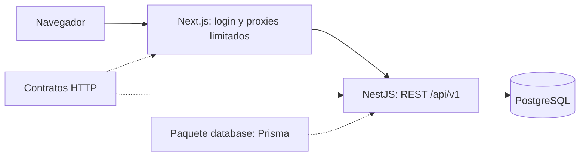

# Arquitectura de MaxBio

MaxBio se organiza como **monolito modular**: una API desplegable y una web desplegable, con PostgreSQL compartido por los módulos de la API. La separación de procesos web/API no implica microservicios de negocio.

## Dependencias y flujo actual



El navegador consulta `/api/system-status`. Next.js llama a `/api/v1/health` usando una URL del entorno del servidor. El controlador delega en `HealthService`, que consulta `DatabaseService`. Este servicio ejecuta `SELECT 1` con Prisma y `@prisma/adapter-pg`. Next.js valida la respuesta; la UI representa conexión, comprobación o indisponibilidad. La información técnica no se muestra en la pantalla.

Identity agrega `/api/auth/*` → `/api/v1/auth/*`, cookie opaca HttpOnly y sesiones persistidas por dispositivo. La web solo presenta estado público de identidad después de validar el contrato; no importa modelos Prisma ni recibe verificadores. AuditService persiste eventos semánticos con la misma transacción de los cambios. La política completa está en [authentication.md](authentication.md).

La conexión a PostgreSQL es diferida. La API puede iniciar cuando la base está caída: liveness sigue disponible y readiness devuelve 503. El pool tiene tiempos máximos de conexión y consulta; se libera al cerrar la aplicación.

## Límites de dominio previstos

| Dominio futuro                   | Responsabilidad y frontera                                            |
| -------------------------------- | --------------------------------------------------------------------- |
| Identity / Organizations / Users | Identidad global, sesiones, pertenencias, organización activa y roles |
| Products / Product Identifiers   | Catálogo, identificación y políticas del producto; no saldos          |
| Suppliers / Clients              | Datos comerciales de cada organización                                |
| Inventory                        | Movimientos, lotes, series, vencimientos, disponibilidad y reservas   |
| Delivery Notes                   | Remitos estructurados y ciclo de vida; representación en adaptadores  |
| Traceability                     | Consultas sobre vínculos y eventos verificables de los otros dominios |
| Billing                          | Documentos y casos de uso de facturación; ARCA detrás de un adaptador |
| Audit                            | Registro transversal de acciones y contexto de ejecución              |
| Files / Documents                | Metadatos y representaciones; almacenamiento detrás de un adaptador   |
| Integrations                     | Adaptadores externos; no autoridad sobre reglas internas de negocio   |

Identity y Audit ya tienen implementación; los límites comerciales orientan el desarrollo y todavía no constituyen módulos ni esquema de datos definitivo. Lotes, series y movimientos inicialmente pertenecen al mismo dominio de inventario, evitando fragmentar operaciones que requieren una transacción.

## Organización del backend

La estructura actual de health mantiene controlador, servicio y módulo juntos porque no tiene reglas de negocio. Para un dominio con reglas, usar progresivamente:

```text
modules/products/
  products.module.ts
  api/                 controllers y DTO de transporte
  application/         casos de uso, autorización y transacciones
  domain/              reglas, invariantes y valores sin NestJS/Prisma
  infrastructure/      repositorios Prisma y adaptadores
```

Es una convención para código futuro, no una obligación de crear cuatro carpetas. Los controladores no consultan Prisma. Los casos de uso coordinan permisos, reglas, persistencia y auditoría. Un módulo consume casos de uso públicos de otro, no su controlador ni sus repositorios internos. Definir interfaces/ports cuando haya una dependencia externa o un límite comprobable; no una interfaz por cada clase.

`packages/database` contiene cliente generado, schema, migraciones y construcción del cliente. La web no importa este paquete. `packages/contracts` contiene solo contratos que hoy cruzan la frontera HTTP; no entidades Prisma, un cajón de utilidades o reglas del dominio. No se crearon paquetes `ui` o `config` sin un segundo consumidor.

## Multi-tenancy y seguridad

Modelo de base compartida, con pertenencias por organización. `User` representa identidad global; `Membership` relaciona usuario, organización y rol ADMIN/OPERATOR. La restricción única `(organizationId, userId)` evita pertenencias duplicadas. La baja se expresa mediante fechas, conservando las relaciones.

**Estado actual:** autenticación, sesiones, contexto tenant y roles ADMIN/OPERATOR implementados. Guard global: solo health y login son públicos; las demás rutas exigen sesión y tenant válido por defecto. CsrfGuard protege todas las escrituras, incluido login. No acepta `x-user-id`, `x-organization-id` ni identidad declarada por el cliente como autoridad. User.disabledAt, Membership.revokedAt, Organization.archivedAt y expiración/revocación de sesión se comprueban en cada request. No existen operaciones comerciales expuestas.

Una pertenencia activa se selecciona automáticamente en login. Varias requieren selección validada server-side, persistida por sesión. El contexto confiable es `RequestActorContext`: usuario, organización, membership, rol, sesión y requestId. `@IdentityOnly()` está limitado al lifecycle de identidad; `@Roles('ADMIN')` aplica autorización de rol. Los métodos administrativos application-only revalidan permisos y no conceden administración global de identidades a un admin de tenant.

Identity ya implementa y prueba los pasos 1–4. Antes de cualquier endpoint empresarial, completar la secuencia para sus propios recursos:

1. Autenticar una identidad mediante un mecanismo de sesión verificado en el servidor.
2. Verificar usuario habilitado, organización no archivada y pertenencia no revocada.
3. Resolver organización activa y rol desde esa pertenencia; una selección enviada por el cliente es solo una solicitud que debe validarse.
4. Crear contexto confiable con `userId`, `organizationId`, `membershipId`, rol, `sessionId` y `requestId`.
5. Exigir ese contexto en cada caso de uso/repository empresarial. Filtrar lecturas, escrituras, listados, exports, archivos e identificadores por `organizationId`.
6. Incluir `organizationId` en índices y unicidad de negocio, y en claves foráneas compuestas para relaciones entre entidades de tenant. Un UUID opaco no es autorización.
7. Probar lecturas y escrituras con dos organizaciones, IDs ajenos, pertenencia revocada y roles insuficientes. Para recursos ajenos devolver una respuesta que no revele su existencia.

No hay filtros automáticos universales de Prisma: son fáciles de omitir en SQL, nested writes y operaciones especiales. Los repositorios futuros deberán expresar el alcance de organización de forma explícita. RLS está diferido y deberá evaluarse como defensa adicional antes de abrir el SaaS a organizaciones independientes; el modelo actual no garantiza aislamiento por sí solo.

## Auditoría y registros históricos

AuditEvent y AuditService implementan auditoría append-oriented con organización/actor/sesión opcionales para eventos de identidad, acción, recurso, resultado, instante UTC y correlación. Login, logout, selección, revocación y disable guardan cambio y evento en una transacción. La interfaz acepta `Prisma.TransactionClient` para cambios comerciales futuros. Metadata se construye mediante allowlist acotada; no contiene credenciales, hashes, tokens, cookies ni dumps de requests. No se expusieron endpoints de edición/borrado. El propietario de DB conserva capacidad técnica de modificar datos; retención y protección frente a administradores de DB se deciden antes de producción.

No confundir logs de operación con auditoría de negocio. Hoy los logs de error solo permiten correlación y no constituyen una auditoría completa. No aplicar borrado físico genérico. Las correcciones de registros históricos necesitarán acciones explícitas, vinculadas al registro original; políticas de retención y obligaciones se analizarán con información real, sin inventar requisitos regulatorios.

## Inventario, documentos e integraciones

El inventario futuro derivará de movimientos; no habrá un campo editable tratado como fuente única de stock. Producto, lote, serie, vencimiento, estados y reservas requieren análisis del dominio. Los saldos podrán materializarse para consultas sin reemplazar el historial. Ajustes y reversiones serán operaciones explícitas; concurrencia, unidad de medida e idempotencia se decidirán antes de implementar.

Un remito será una entidad estructurada con líneas y relaciones. PDF, impresión en formulario preimpreso y archivos son representaciones. Generar una representación no debe ser el único registro de una operación.

ARCA, ANMAT/SNT, almacenamiento, email e IA se conectarán mediante adaptadores fuera del dominio. Una IA futura operará exclusivamente mediante tools/casos de uso autorizados, con el mismo contexto, permisos y auditoría que un humano; no recibirá SQL libre ni credenciales de PostgreSQL. No se agregó broker, Redis ni procesamiento asíncrono preventivo.
