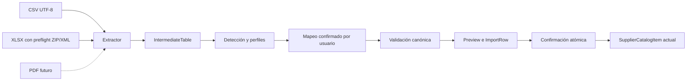

# Importador de listas de proveedores V2

> Documento histórico del incremento anterior. Para el comportamiento vigente (análisis automático, códigos propios y precios a centavos), ver [Importador automático](supplier-catalog-automatic.md) y [verificación actual](supplier-catalog-automatic-verification.md).

Implementación del 7 de octubre de 2026 sobre el importador existente. Mantiene preview, confirmación atómica, roles, tenant, auditoría, asociaciones e idempotencia. No incorpora PDF, OCR, IA, compras ni cambios de Inventory.

## Arquitectura y frontera de extracción

`catalog-table.ts` define `SupplierCatalogExtractor.extract(buffer: Buffer): Promise<WorkbookInspection>`. Devuelve `tables: IntermediateTable[]` y `warnings: string[]`. Cada tabla contiene:

- `name` y `rows: string[][]`, conservando posiciones y números de fila originales; cada celda contiene exclusivamente texto/lexemas, sin código ejecutable.
- `cellStates`, un mapa disperso con claves `fila:columna` (fila desde 1, columna desde 0): `STORED_RESULT` o `UNAVAILABLE`.
- `numericCells`, claves de números almacenados con punto decimal inequívoco; `percentageCells`, claves cuyo valor representa una fracción porcentual.
- `warnings`, advertencias humanas de extracción.

Los adaptadores `CsvSupplierCatalogExtractor` y `XlsxSupplierCatalogExtractor` usan la extracción validada existente. `parseCatalogFile` conserva la validación de extensión/MIME, nombre seguro y SHA-256 del contenido. Detección, mapping, validación y commit reciben tablas o datos canónicos; no interpretan XML, ZIP ni fórmulas. `UnknownFormatAnalyzer` define una frontera opcional para una futura propuesta de interpretación, sin dependencia de un LLM ni llamadas de red actuales.

El staging temporal conserva tablas acotadas durante 30 minutos; se elimina tras confirmar o mediante el cleanup existente. No se almacena el archivo original. Solo las filas canónicas y la estructura confirmada forman parte de la historia duradera.

## Detección, heurísticas y confianza

Se inspeccionan todas las hojas admitidas. Se puntúan los primeros 20 posibles encabezados combinando campos esenciales, alias reconocidos y hasta 20 filas posteriores consistentes. Los encabezados se normalizan sin acentos, espacios ni puntuación. Hay alias para códigos (`CODIGO`, `SKU`, `ART`, `REF`), descripción (`DESCRIPCION`, `PRODUCTO`, `DETALLE`, `NOMBRE`), precio (`PRECIO`, `P. UNITARIO`, `NETO`, `VALOR`), IVA (`IVA`, `T.IVA`, `ALICUOTA`), alternativo (`COD_EXT`), marca, presentación, GTIN/EAN/barcode y moneda.

La muestra de contenido verifica patrones de códigos, números y monedas. Para nombres desconocidos, una columna claramente compatible puede proponerse por contenido, siempre con `REVIEW`. No se infiere que código alternativo sea GTIN ni que NETO/PRECIO indique inclusión de IVA.

Cada campo tiene `HIGH`, `REVIEW` o `MISSING`; la UI muestra Detectado, Revisar o No encontrado. Dos candidatos como CODIGO y CODIGO 2 no eligen código automáticamente. Dos tablas con encabezados incompatibles y puntuación similar requieren revisar. La hoja sugerida exige código/descripción confiables y datos tabulares; una diferencia de menos del 20% en filas entre dos candidatas deja la elección al usuario. Un perfil con formato y nombre de hoja confirmados puede resolver esa elección. El usuario siempre revisa mapping y preview y confirma expresamente.

Puede cambiar hoja, encabezado (1–20), columna o elegir «No importar este campo». Cambiar encabezado solicita un nuevo análisis sobre el staging, sin reabrir el archivo. Cambiar mapping exige un nuevo preview. No se prometen layouts arbitrarios, tablas disjuntas ni varias listas incompatibles en una región.

## Perfiles y firma estructural

`SupplierCatalogImportProfile` pertenece a organización y proveedor, con FK compuesta a Supplier. Su unique es `(organizationId, supplierId, fingerprint)`. Guarda encabezados, índices confirmados, hoja, fila de encabezado y opciones comerciales explícitas; nunca el archivo ni filas de productos. Como máximo se conservan 20 formatos recientes por proveedor.

Fingerprint SHA-256 sobre versión del detector y encabezados normalizados en orden, incluido su número de columnas. No incluye nombre del archivo, cantidad de filas, productos ni precios. Cambiar abril por mayo conserva el formato; reordenar/agregar/quitar columnas o cambiar encabezados obliga a detectar nuevamente. La coincidencia es deliberadamente conservadora. El perfil es una propuesta revisable, no una plantilla obligatoria.

Se guarda/actualiza solo dentro del commit exitoso y si el usuario eligió recordar el formato. Un preview no crea perfil. La UI permite olvidar formatos de ese proveedor; ADMIN puede consultarlos y restablecerlos. Restablecer registra un evento mínimo `SUPPLIER_CATALOG_PROFILES_RESET`. Las exclusiones de filas no forman parte del perfil.

## Modelo comercial, Decimal e historial

| Campo en SupplierCatalogItem y snapshot | Representación                                                  |
| --------------------------------------- | --------------------------------------------------------------- |
| supplierCode / description              | Obligatorios; identidad por código dentro del proveedor         |
| alternateSupplierCode                   | Texto secundario nullable, hasta 128 caracteres                 |
| brandText / presentationText            | Declaraciones textuales existentes                              |
| reportedGtin / normalizedReportedGtin   | Declaración; normalizado solo con GTIN válido                   |
| price                                   | PostgreSQL NUMERIC(32,18), nullable; JSON string decimal exacto |
| currency                                | Código estable de tres letras, nullable sin precio              |
| vatRate                                 | NUMERIC(7,4), nullable, entre 0 y 100; acepta 0, 10.5 y 21      |
| priceIncludesVat                        | YES / NO / UNKNOWN; default UNKNOWN                             |

La semántica del precio se confirma a nivel de lista/import (`commercial.priceIncludesVat`) y se copia a cada observación e item actual. Esto permite conservar la semántica del precio anterior cuando la nueva lista no importa precio. No calcula impuestos ni convierte monedas.

Se usan strings para normalizar números; nunca Float ni parseFloat. Se conserva hasta 14 dígitos enteros y 18 decimales de precio. La precisión proviene del Excel real: contiene lexemas como `218505.11669999998`, que exceden seis decimales. No se redondean ni se «corrigen» artefactos numéricos del proveedor. Normalización elimina ceros insignificantes, sin cambiar el valor; la API usa Decimal.toFixed() para evitar notación exponencial en respuestas.

Admite coma/punto decimal y agrupación validada. `1.234` en texto es ambiguo y pide elegir separador, mientras que una celda numérica XLSX `1.234` es inequívoca. No inventa importes ante ambigüedad, signo negativo, texto inválido o exceso de precisión. IVA con estilo porcentual XLSX transforma exactamente la representación 0.105 a 10.5%; esto no es cálculo fiscal.

Moneda en columna o prefijo inequívoco del precio (ARS/USD/EUR/US$) tiene prioridad. `$` solo no determina moneda. Cuando falta, la UI propone ARS y exige confirmación/cambio explícito antes de importar precios. Si una fila sigue sin moneda, el preview la marca ERROR. Celdas vacías de moneda pueden usar el default confirmado; dos monedas explícitas contradictorias bloquean la fila. Listas sin precio pueden conservar moneda desconocida. No se verifica un registro completo ISO-4217: el código debe ser estable de tres letras y revisado por el usuario.

Campo opcional no mapeado conserva el estado anterior; columna mapeada con celda vacía lo limpia. Si no se importa precio, un default monetario no reinterpreta el precio anterior. Cada `SupplierCatalogImportRow.data` conserva su snapshot, incluyendo precio/moneda/IVA/semántica/alternativo. Abril = 100 y mayo = 120 actualizan el item a 120 sin cambiar abril. La lectura de snapshots V1 incorpora defaults null/UNKNOWN, sin inventar datos históricos.

Importar crea **0 Product, 0 ProductIdentifier, 0 SupplierProduct por inferencia, 0 InventoryMovement y 0 stock**. Reimportar conserva la asociación `SupplierCatalogItem → SupplierProduct`. Un código distinto crea una referencia distinta; coincidencia fuerte de descripción y GTIN válido o código alternativo previo produce conflicto para revisión, sin reconciliación silenciosa.

## Fórmulas, macros, enlaces y defensas

La dependencia existente read-excel-file 9.3.10 lee valores almacenados y no evalúa fórmulas. Se revisaron su README y código instalado (`parseCell`, `parseSheet`, `parseFilePaths`, `unpackXlsxFileNode`). No se agregó ni cambió ninguna dependencia o lockfile. La lectura recibe exclusivamente Buffer, no una URL; las relaciones sirven para localizar entradas internas, no para ejecutar requests.

- Fórmula en columna ignorada: no invalida la lista ni esa referencia.
- Campo importado con resultado guardado: conserva ese valor y advierte que puede estar desactualizado. No se afirma que el resultado sea reciente o correcto fiscalmente.
- Campo importado sin resultado, vacío o con error Excel: esa fila es ERROR, incluso si el campo es opcional. Puede cambiar mapping para ignorarlo o excluir expresamente la fila.
- Fórmulas compartidas/de matriz: se anotan las celdas/rangos declarados dentro de límites; nunca se calcula su contenido.
- Macros, contenedores macroEnabled, VBA, binarios y archivos incrustados: rechazo humano. No se agregó XLSM/XLS.
- ExternalLinks/hyperlinks/relaciones externas: se conservan como advertencia; nunca se abren, descargan, actualizan ni resuelven. Solo se usan valores disponibles en el archivo.

Se mantiene el preflight secuencial antes del lector: tamaños ZIP declarados y reales, 40 MiB de expansión, 20 MiB por entrada, 1000 entradas, paths seguros, duplicadas/encriptadas rechazadas. SAX mantiene límites de profundidad 64 y 2.000.000 nodos, rechaza DTD/entidades externas y XML malformado. Atributos se decodifican antes de validar coordenadas, rangos y relaciones; se rechazan celdas/dimensiones/rangos dispersos fuera de límites. Hojas con raíz worksheet también quedan protegidas aunque su entrada use una ruta no convencional.

No se eliminó el preflight. Los límites de 10 MiB, 10.000 filas de datos, 100 columnas, 20 hojas, 4.000 caracteres/celda y texto agregado existente siguen vigentes. Parsing fuera de transacción comercial; commit conserva bloques SQL parametrizados de 500 y timeout 10 s. Los errores no incluyen paths, stack, Prisma, SQL ni secretos.

## CSV y filas no producto

CSV UTF-8 con/sin BOM. Delimitador entre coma, punto y coma o tabulación, analizando las primeras 40 líneas y excluyendo texto entre comillas; puede detectar encabezado después de títulos. csv-parse conserva comillas, filas y valores textuales; límites por fila/celda se verifican durante el parseo. No hay evaluación de expresiones CSV ni casts de códigos. Encoding alternativo y delimitador mixto quedan fuera de alcance.

Vacías → EMPTY. Encabezados repetidos → EMPTY con mensaje. Total/subtotal explícito sin datos de referencia → EMPTY con evidencia. Filas dudosas con campos requeridos faltantes → ERROR con indicación de posible nota/título; no se eliminan silenciosamente. Un producto real con código TOTAL y descripción específica sigue siendo referencia. «Filas para ignorar» permite excluir números explícitos y deja constancia por fila en historia; no guarda exclusiones para próximas listas.

PARTIAL y COMPLETE siguen vigentes. COMPLETE solo marca ausencia comercial, nunca archiva Products ni borra Inventory. Errores/conflictos suprimen cambios de completitud. Ignorar filas manualmente es una decisión explícita del usuario que debe revisar su lista completa antes de confirmar.

## Endpoints, UX, roles, auditoría e idempotencia

| Método | Ruta bajo /api/v1                                      | Función                                                                      |
| ------ | ------------------------------------------------------ | ---------------------------------------------------------------------------- |
| POST   | /suppliers/:id/catalog-imports/inspect                 | Upload y análisis inicial existentes, ahora con sugerencia de hoja/confianza |
| POST   | /suppliers/:id/catalog-imports/analyze                 | Reanalizar hoja/encabezado del upload privado                                |
| POST   | /suppliers/:id/catalog-imports/preview                 | Mapping, opciones comerciales, exclusiones y elección de guardar perfil      |
| POST   | /supplier-catalog-imports/:id/commit                   | Hash del preview, exclusión expresa de inválidas; idempotente                |
| GET    | /suppliers/:id/catalog-import-profiles                 | Formatos confirmados, ADMIN                                                  |
| POST   | /suppliers/:id/catalog-import-profiles/reset           | Olvidar formatos del proveedor, ADMIN                                        |
| GET    | /supplier-catalog-imports/:id y /rows                  | Resumen e historia paginada existentes                                       |
| GET    | /suppliers/:id/catalog-items y /supplier-catalog-items | Referencias actuales existentes con campos comerciales                       |

Contratos Zod estrictos y whitelist del proxy web incluyen las nuevas rutas; no hay proxy abierto. OrganizationId siempre viene de RequestActorContext, nunca del body. Guard y application layer exigen ADMIN para análisis/mapping/commit/perfiles; OPERATOR conserva consulta de referencias e historia. Upload y preview siguen privados al actor/sesión. FKs compuestas defienden tenant/proveedor del perfil y de imports/items/filas existentes.

Archivo → Analizar → Información detectada → Revisar lista → Confirmar → Resultado. La propuesta no confirma automáticamente. UI incluye moneda explícita, IVA YES/NO/UNKNOWN, separador decimal, guardar/olvidar formatos y excluir filas. Preview e historia muestran campos comerciales normalizados y advertencias. Fichas/listas muestran precio actual y código alternativo; GTIN sigue siendo dato declarado.

Commit mantiene locks Supplier → Import, compara fingerprint comercial/versiones, revalida datos y hash antes de transacción, preserva unique de código y asociaciones. Hash incluye opciones comerciales, estructura y plan completo; no acepta filas nuevas en commit. Cambio del catálogo exige preview nuevo. Reintento devuelve el resultado original con un solo evento `SUPPLIER_CATALOG_IMPORTED`. Audit conserva metadata allowlisted de resumen; no emite miles de eventos de precios. Error de auditoría revierte también el perfil.

## Migración y verificación

Nueva migración Prisma Migrate `20261007120000_supplier_catalog_v2`: columnas comerciales, metadata de importación, tabla/unique/FKs de perfiles y CHECKs de montos/IVA/moneda/semántica/estructura. No modifica migraciones anteriores ni usa db push. No requiere precio/moneda histórico inventado. Installaciones existentes: `pnpm db:migrate`; regenerar paquetes/reiniciar `pnpm dev` cuando corresponda.

La evidencia final de comandos y la aceptación exacta está en [verificación V2](supplier-catalog-v2-verification.md). Incluye suites de formatos/detección/seguridad/perfiles/negocio, regresión completa y migraciones desde cero mediante la suite Inventory. No se versionó el Excel comercial.

## Conectar PDF y próximo incremento

`PdfSupplierCatalogExtractor` deberá implementar exactamente `SupplierCatalogExtractor.extract(buffer): Promise<WorkbookInspection>`. Emitirá tablas con `name`, `rows` textuales con posiciones estables y advertencias; las celdas cuya extracción sea incierta deberán marcarse UNAVAILABLE, sin inventar texto/precio. Solo marcará numericCells/percentageCells cuando esa representación sea inequívoca. Será necesario adaptar la validación de upload/extensión/MIME y el dispatch para registrar ese extractor.

Reutilizará `inspectSheet`, `detectMapping`, `formatFingerprint`, perfiles, pantalla de mapping, `planImport`, validación comercial/GTIN, preview, historial, permisos, aislamiento, auditoría e idempotencia de commit. Deberá respetar los mismos límites de filas/columnas/texto y agregar sus propias defensas de PDF. No reutilizará ni quitará defensas ZIP/XML del adaptador XLSX.

Siguiente incremento recomendado: probar este contrato con el PDF original de Massuar, medir calidad de extracción y delimitar intervención humana antes de desarrollar soporte PDF. La revisión visual de navegador/Excel queda pendiente cuando haya una superficie de navegador disponible; la verificación HTTP y contra lexemas fuente no reemplaza esa inspección visual.
